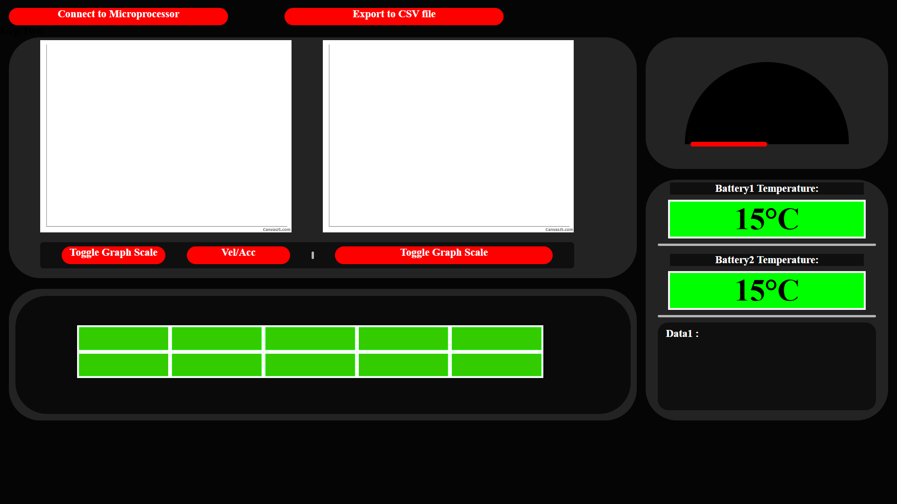

# Hyperloop2022

The G.U.I. and Arduino code that I wrote when I was part of Warwick Hyperloop (2022-2023)

# Arduino Boards
An Arudino Mega was connected to the relevant electronics and sensors inside the pod. One of these components was the NRF24l01 transceiver, which communicated with another attached to an Arduino nana, which in turn was connected to a laptop.

This system allowed data from the sensors on the Arduino Mega to be read and displayed on a G.U.I. made using HTML and CSS.

# The G.U.I.

The G.U.I. is rudementary, it displays the motion and current draw data on charts with respects to time, and logs the data which can then be exported to a csv file. This G.U.I. is to be  used while the constructed Warwick Hyperloop pod runs on itsa aluminium track, and was used to log the motion data of the pod during testing.   

  

